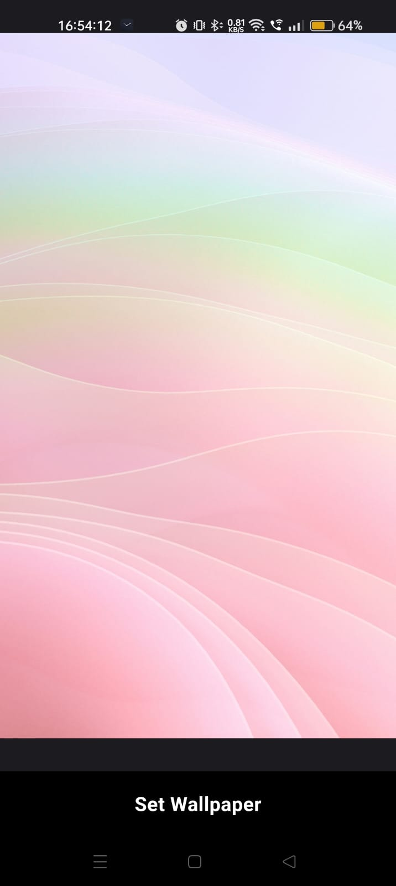

# WallGram

## Description
WallGram is an elegant Flutter application that connects to the Unsplash API to provide users with a stunning collection of high-quality photos. With WallGram, you can browse through beautiful images, load more photos dynamically, and set your favorite picture as the wallpaper directly from the app.

## Features
- Live photo feed from Unsplash API.
- Load More feature for seamless photo browsing.
- Set any photo as device wallpaper with a single tap.

## Screenshots
1. Home Screen:
   

2. Set Wallpaper:
   

